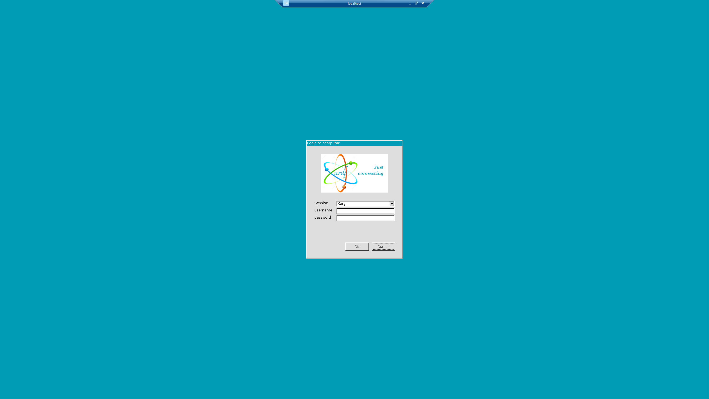
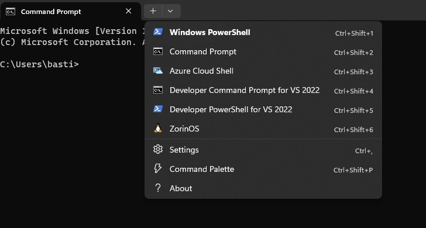
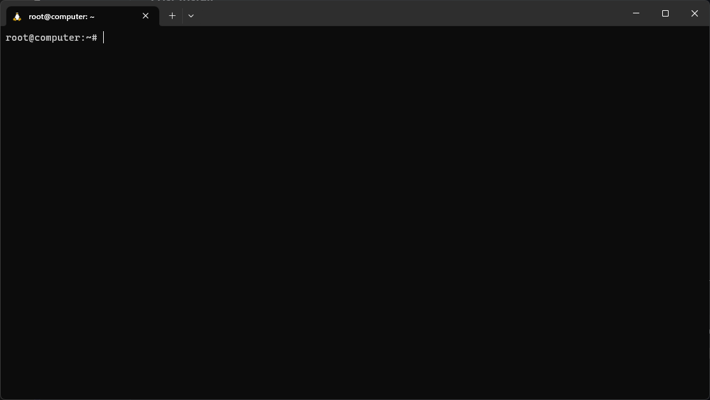
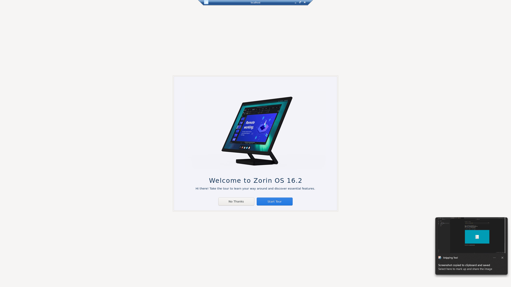

With the help of this Intsruction, you should be capable to install ISE, required for our class DIC, via the WindowsSubsytemforLinux short (**WSL**) i used the *Zorin OS Distro. 

**Requierments:**
* **This may only work with Windows 11** i cannot gurantee if it will work with other versions. 
* Always start PowerShell as **Admin**
* For the Terminal the newest Version of the Windows Terminal is recomended

[TOC]

## Installing WSL

* First Startup PowerShell as a **Administrator**

There enter the following commands:
```powershell
dism.exe /online /enable-feature /featurename:Microsoft-Windows-Subsystem-Linux /all /norestart
```

```powershell 
dism.exe /online /enable-feature /featurename:VirtualMachinePlatform /all /norestart
```

* **Now restart your Computer** 
* Restart Powershell and copy the follwing commands: 
```powershell 
wsl --set-default-version 2
```

now the PowerShell should return: 
```
For information on key differences with WSL 2 please visit https://aka.ms/wsl2
The operation completed successfully.
```

now you need to update the subsystem
```powershell 
wsl --update
```

now your Subsystem is **ready**

### WSL commands
* start Distro
```powershell
wsl --distribution ZorinOs
```
* stop Distro
```powershell
wsl --shutdown ZorinOs
```
* list all Distros
```powershell
wsl -l -v
```
*here you can see the status of the distro aswell as the Place etc.*

## Installing Ubuntu 

Download Ubuntu [here](https://www.microsoft.com/store/productId/9PDXGNCFSCZV)
the open it 
this should appear in a cmd:
```
Import in progress, this may take a few minutes....
```

now u have to select a unix username and password, be sure to remember these you need these often 

Now open a new Terminal and select a ubuntu Terminal on the top 

now enter the following command: 

```shell
sudo apt update && sudo apt -y upgrade 
```

when its done:
*this is a remote client so you can access the ubuntu gui*
```shell
sudo apt install xrdp
```
*you may need to enter a 'y' if a prompt with 'Do you want to continue' appears*

then we install a lightweight ui:
```shell 
sudo apt install -y xfce4
```
and some addons
```shell 
sudo apt install -y xfce4-goodies
```

so now we need to change the server port to 3390: 

```shell 
sudo sed -i 's/3389/3390/g' /etc/xrdp/xrdp.ini
```

now we start the server:
```shell 
sudo /etc/init.d/xrdp start
```

**Now we open Remote Desktop Connection**
there we type in `localhost:3390` and press connect 
please press yes on the upcomming popup 

now a full screen application should appear: 



now you type in your created cridentals 

now you should have this screen: 

## Installing ZorinOs 


you may now download your preferd distro, in this instruction we use ZorinOS
download it [here](https://anonfiles.com/RaT022W9yc/ZorinOS_WSL2_7z)

Download the File, unzip it with 7Zip, and open the File "Install Zorin.bat" as **Admin** 

This should appear: 
```
Import in progress, this may take a few minutes....
```


you now need to wait until this is imported 


Now you need a new ZorinOs Tab in your Terminal:

*Press on the down erow in the tab bar and select ZorinOs*

Now you have to create your unix cridentals, these are very important so remeber these!

now the distro will be installed this may take some time. 

Now the Terminal should look like this:


now enter the following command: 

```shell
sudo apt update && sudo apt -y upgrade 
```

when its done: 
```shell
sudo apt install xrdp
```
*you may need to enter a 'y' if a prompt with 'Do you want to continue' appears*

then we install a lightweight ui:
```shell 
sudo apt install -y xfce4
```
and some addons
```shell 
sudo apt install -y xfce4-goodies
```

so now we need to change the server port to 3390: 

```shell 
sudo sed -i 's/3389/3390/g' /etc/xrdp/xrdp.ini
```

now we start the server:
```shell 
sudo /etc/init.d/xrdp start
```

**Now we open Remote Desktop Connection**
there we type in `localhost:3390` and press connect 
please press yes on the upcomming popup 

now a full screen application should appear: 


now you type in your created cridentals 

now you should have this screen: 


please click through this installer until its done
**now you have zorinOs installed** 

now you have a Problem. (proabably)
beacause the desktop crashed... 
you can fix this by changing some lines in the code. 


now you need to give yourself the rights to edit a xrdp file, you can acieve this through the following command in the ZorinOs Terminal:
```shell 
sudo chmod 777 /etc/xrdp/startwm.sh
```

now you need to open the file:
```shell
nano /etc/xrdp/startwm.sh
```
and change it so it looks like this: 
```shell 
#!/bin/sh
# xrdp X session start script (c) 2015, 2017 mirabilos
# published under The MirOS Licence

if test -r /etc/profile; then
        . /etc/profile
fi

if test -r /etc/default/locale; then
        . /etc/default/locale
        test -z "${LANG+x}" || export LANG
        test -z "${LANGUAGE+x}" || export LANGUAGE
        test -z "${LC_ADDRESS+x}" || export LC_ADDRESS
        test -z "${LC_ALL+x}" || export LC_ALL
        test -z "${LC_COLLATE+x}" || export LC_COLLATE
        test -z "${LC_CTYPE+x}" || export LC_CTYPE
        test -z "${LC_IDENTIFICATION+x}" || export LC_IDENTIFICATION
        test -z "${LC_MEASUREMENT+x}" || export LC_MEASUREMENT
        test -z "${LC_MESSAGES+x}" || export LC_MESSAGES
        test -z "${LC_MONETARY+x}" || export LC_MONETARY
        test -z "${LC_NAME+x}" || export LC_NAME
        test -z "${LC_NUMERIC+x}" || export LC_NUMERIC
        test -z "${LC_PAPER+x}" || export LC_PAPER
        test -z "${LC_TELEPHONE+x}" || export LC_TELEPHONE
        test -z "${LC_TIME+x}" || export LC_TIME
        test -z "${LOCPATH+x}" || export LOCPATH
fi
unset DBUS_SESSION_BUS_ADDRESS
unset XDG_RUNTIME_DIR
.$HOME/.rofile

if test -r /etc/profile; then
        . /etc/profile
```

*so you need to add 
```shell
unset DBUS_SESSION_BUS_ADDRESS
unset XDG_RUNTIME_DIR
.$HOME/.rofile
```
these lines under the 'fi'


now exit the programm with ctrl + X
then press 'Y'
then enter

it might be mandatory to restart the xrdp with the following command:
```shell 
 sudo service xrdp restart
```

now remote back in that should work !

if you still run into issues, like a screen with o no, system cant recover please reset your wsl:
open Settings on your Windows -> go to installed apps -> search for Windows Subsystem vor Linux -> properties -> Reset 

now it should work 

## Installing ISE
	
first download the ISE [here](https://www.xilinx.com/member/forms/download/xef.html?filename=Xilinx_ISE_DS_Lin_14.7_1015_1.tar&akdm=0)
wait until its completly downloaded

now minimize the remote session at the middle top of the screen in the blue box 
in your windows open a Termial and select a ZorinOs terminal
there **navigate** to your downloaded File using **cd** like this:
```shell
cd Downloads
```

now you need to unpack the tar with the following command: 
```shell
tar xvf Xilinx_ISE_DS_Lin_14.7_1015_1.tar -C /tmp/
```
*waint until this unpacking is completed...*

